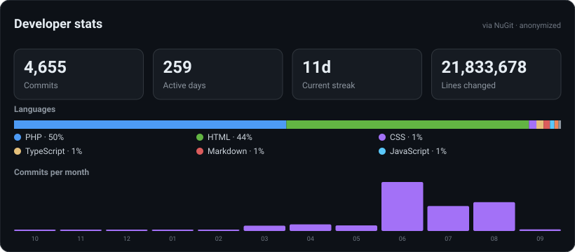

# Hi, I'm Bjarne 👋  

💻 **Software Engineer**

---

### 🚀 About Me  
- 🧑‍💻 I love building scalable applications and modern web platforms.  
- 🔧 Experienced in **C#**, **JavaScript/TypeScript**, **PHP**, and frameworks like **Next.js**, **React**, **Vue**, and **CodeIgniter 4**.  
- 📐 Currently working on [**Rack Planner**](https://rack-planner.xyz) — a visual server rack planning tool.  

---

### 🛠️ Tech Stack  
- **Languages:** C#, PHP, JavaScript, TypeScript  
- **Frontend:** React, Next.js, Vue  
- **Backend:** CodeIgniter 4, Node.js  
- **Other Interests:** Infrastructure, hosting automation, server management  

---

### 📌 Featured Projects  
- 📐 [**Rack Planner**](https://rack-planner.xyz) — Plan and visualize server racks interactively.  

---

### 📫 Get in Touch  
- 🌐 Website: [nucez.com](https://nucez.com)
- 🌐 Website: [rack-planner.xyz](https://rack-planner.xyz)
---

⭐️ *Always building, always learning.*

<!-- NUGIT:STATS:START -->
### Developer stats

Anonymized totals from 112 repositories · updated 2026-09-02 by NuGit
<!-- NUGIT:STATS:END -->
